# Visual SLAM

Visual SLAM framework for trajectory estimation, loop-closure correction, and reproducible benchmarking across synthetic and real image sequences.

This module implements a full visual localization pipeline that starts from raw camera frames and produces aligned trajectory outputs, perception quality metrics, and exportable artifacts for analysis. It is structured for clarity, reproducibility, and iterative experimentation, while still operating on real-world data.

## Problem

Estimate a camera's planar trajectory from a sequence of images while limiting the accumulated drift that arises from frame-to-frame visual odometry. The project must work both on a controllable synthetic scene and on the bundled Freiburg/TUM-style RGB sequence, detect revisited places, refine the estimated trajectory, and report results against a reference trajectory when one is available.

This is a lightweight educational Visual SLAM pipeline, not a full landmark-based or nonlinear bundle-adjustment system. Its purpose is to make the trade-offs among feature quality, keyframe selection, loop closure, and trajectory smoothing observable and reproducible.

## Research Context

This project addresses the research problem of how lightweight, feature-based Visual SLAM pipelines can be systematically benchmarked and improved through modular trajectory refinement and loop-closure correction — a core challenge for autonomous navigation in unknown environments. In the SLAM literature, ORB-SLAM (Mur-Artal et al., *IEEE Trans. Robotics*, 2015) demonstrated that ORB features provide a robust front-end for real-time monocular SLAM, while earlier work on loop-closure detection (Cummins & Newman, *IJRR*, 2008) and trajectory optimization (Strasdat et al., *RSS*, 2010) established the fundamental trade-off between computational efficiency and localization accuracy that all practical SLAM systems must navigate. This implementation bridges textbook exposition and modern SLAM by providing a complete, modular pipeline — from ORB feature extraction through pose graph optimization — that supports both synthetic benchmarking and real-world TUM-style RGB sequences. By exposing trajectory drift, loop-closure correction, and trajectory alignment metrics (Sim2/SE2) in a controlled environment, the project enables systematic investigation of how keyframe selection, feature quality, and smoothing-based refinement affect overall localization accuracy, serving as a practical testbed for SLAM research and education alike.

The project supports two operating modes:

- Synthetic mode for controlled, repeatable evaluation.
- Real-data mode using Freiburg/TUM-style RGB sequences with optional reference trajectories.

## Highlights

- End-to-end pipeline: detection, matching, odometry, loop closure, trajectory refinement.
- Modular architecture with clear boundaries between geometry, features, mapping, and data loading.
- Quantitative and visual outputs for fast quality inspection.
- Trajectory alignment support with SE2 and Sim2 for fair trajectory comparison.

## Architecture

The pipeline is split into input, visual-odometry, mapping/refinement, and evaluation stages. Synthetic mode renders grayscale frames and supplies a known reference path; real-data mode reads the bundled RGB sequence and its optional ground truth. Both modes use the same feature, matching, mapping, loop-closure, refinement, alignment, and reporting stages.

```mermaid
flowchart LR
  A[Synthetic scene or bundled TUM-style RGB sequence] --> B[Grayscale input frames]
  B --> C[ORB keypoints and binary descriptors]
  C --> D[Brute-force Hamming matching]
  D --> E[RANSAC partial-affine motion estimate]
  E --> F[SE2 pose accumulation]
  F --> G[MapBuilder: frames and periodic keyframes]
  C --> H[LoopClosureDetector: match against older keyframes]
  G --> H
  H --> I[Loop correction and trajectory smoothing]
  I --> J[SE2 or Sim2 alignment to reference]
  J --> K[RMSE, drift, feature/inlier metrics, plots, JSON]
```



## Algorithms and Libraries

Algorithms implemented in this folder:

- ORB detection and binary descriptor extraction (up to 1,500 features per frame).
- Brute-force descriptor matching with Hamming distance and cross-checking.
- `cv2.estimateAffinePartial2D` with RANSAC for relative 2D rotation and translation estimation.
- Planar SE2 pose accumulation and periodic keyframe selection.
- Descriptor-based loop-closure detection against sufficiently old keyframes, gated by match count and match ratio.
- Lightweight trajectory refinement: odd-window moving-average smoothing, yaw unwrapping, and linear drift redistribution. The class is named `BundleAdjustment`, but it does not perform landmark-based nonlinear bundle adjustment.
- SE2 and Sim2 trajectory alignment, plus position RMSE and endpoint-drift evaluation.

Runtime libraries:

- Python 3.10+ (tested configuration uses Python 3.11)
- NumPy
- OpenCV (`opencv-python`)
- Matplotlib
- PyYAML

## Repository Layout

- visual_slam_entry.py: CLI entry point and mode selection.
- visual_slam.py: shared synthetic pipeline helpers, plotting, and trajectory alignment.
- dataset_loader.py: real-data loading and real-data execution pipeline.
- features.py: ORB feature extraction, descriptor matching, affine RANSAC motion estimation.
- mapping.py: frame storage, keyframes, loop closure, smoothing-based refinement.
- scene.py: synthetic world generation and frame rendering.
- geometry.py: camera projection and geometry utilities.
- config.yaml: default runtime parameters.
- visual_slam_output/: generated plots and metrics.

## Setup and Run Guide

All commands below are scoped to this project folder; they do not require the repository-wide `requirements.txt`.

```bash
cd src/simulations/visual_slam
python3 -m venv .venv
source .venv/bin/activate  # Windows PowerShell: .venv\Scripts\Activate.ps1
python -m pip install --upgrade pip
python -m pip install numpy opencv-python matplotlib pyyaml
```

The real-data example uses the bundled sequence at `data/rgbd_dataset_freiburg1_xyz/`; no download is required for the checked-in project state.

### 1) Synthetic mode

```bash
python visual_slam_entry.py
```

### 2) Real-data mode

```bash
python visual_slam_entry.py --dataset-mode
```

### 3) Interactive plotting

```bash
python visual_slam_entry.py --show
python visual_slam_entry.py --dataset-mode --show
```

Optional commands:

```bash
# Use an alternate configuration file.
python visual_slam_entry.py --config /path/to/config.yaml

# The CLI accepts this option, but the current loader still reads the bundled data directory.
python visual_slam_entry.py --dataset-mode --dataset-path /path/to/data
```

On completion, the command prints frame, keyframe, loop-closure, RMSE, drift, and output-file information. Default settings and output names are in `config.yaml`.

## Outputs

Default output directory:

src/simulations/visual_slam/visual_slam_output/

Generated artifacts:

- visual_slam_summary.png: trajectory and perception-metric overview.
- visual_slam_mosaic.png: first, middle, and last frame visualization.
- performance_metrics.json: run metrics when generated by the entry pipeline.

The current outputs are:

- Real Data

- [visual_slam_summary.png](visual_slam_output_real/visual_slam_summary.png)
- [visual_slam_mosaic.png](visual_slam_output_real/visual_slam_mosaic.png)

- Synthetic Data

- [visual_slam_summary.png](visual_slam_output_synthetic/visual_slam_summary.png)
- [visual_slam_mosaic.png](visual_slam_output_synthetic/visual_slam_mosaic.png)

Figure interpretation:

- Green: reference trajectory.
- Red: raw estimated trajectory.
- Blue dashed: refined trajectory.
- Magenta links and points: loop-closure events.

## Configuration

Defaults are defined in config.yaml:

- Camera: resolution and meters_per_pixel.
- Trajectory: frame count and path shape parameters.
- VSLAM: keyframe stride, minimum matches, loop-closure constraints, smoothing window.
- Output: directory and artifact names.

Tune these values to adjust runtime, scene difficulty, and trajectory behavior.

## Trajectory Alignment

For trajectory comparison, the project supports:

- Sim2: scale + rotation + translation (default in current reporting).
- SE2: rotation + translation.

Alignment utilities are implemented in visual_slam.py and applied before reporting drift and RMSE in current pipelines.

## Current Implementation Notes

- The real-data loader currently expects bundled dataset structure under this module's data/ folder.
- --dataset-path is accepted by CLI, but external path override is not fully wired in current loader logic.
- Refinement uses smoothing and drift redistribution rather than full nonlinear bundle adjustment over landmarks.
- Feature front-end is ORB-based in the current implementation.

## Recommended Comparison Workflow

```bash
python visual_slam_entry.py
python visual_slam_entry.py --dataset-mode
```

Comparison focus areas:

- Trajectory error before and after refinement.
- Loop-closure consistency across both modes.
- Feature and inlier behavior over the full sequence.

## License

See repository-level license file.
