# Visual SLAM

Visual SLAM framework for trajectory estimation, loop-closure correction, and reproducible benchmarking across synthetic and real image sequences.

This module implements a full visual localization pipeline that starts from raw camera frames and produces aligned trajectory outputs, perception quality metrics, and exportable artifacts for analysis. It is structured for clarity, reproducibility, and iterative experimentation, while still operating on real-world data.

The project supports two operating modes:

- Synthetic mode for controlled, repeatable evaluation.
- Real-data mode using Freiburg/TUM-style RGB sequences with optional reference trajectories.

## Highlights

- End-to-end pipeline: detection, matching, odometry, loop closure, trajectory refinement.
- Modular architecture with clear boundaries between geometry, features, mapping, and data loading.
- Quantitative and visual outputs for fast quality inspection.
- Trajectory alignment support with SE2 and Sim2 for fair trajectory comparison.

## Pipeline Overview

```mermaid
flowchart LR
  A[Input frames] --> B[ORB detect and describe]
  B --> C[Descriptor matching]
  C --> D[Relative motion estimation]
  D --> E[Pose accumulation]
  E --> F[Keyframe storage]
  F --> G[Loop closure detection]
  G --> H[Trajectory refinement]
  H --> I[SE2 or Sim2 alignment to reference]
  I --> J[Summary figure and metrics]
```



## Repository Layout

- visual_slam_entry.py: CLI entry point and mode selection.
- visual_slam.py: shared synthetic pipeline helpers, plotting, and trajectory alignment.
- dataset_loader.py: real-data loading and real-data execution pipeline.
- features.py: ORB feature extraction, descriptor matching, affine RANSAC motion estimation.
- mapping.py: frame storage, keyframes, loop closure, smoothing-based refinement.
- scene.py: synthetic world generation and frame rendering.
- geometry.py: camera projection and geometry utilities.
- config.yaml: default runtime parameters.
- visual_slam_output/: generated plots and metrics.

## Installation

From repository root:

```bash
conda create -n avc python=3.11
conda activate avc
pip install -r requirements.txt
```

Core dependencies:

- numpy
- opencv-python
- matplotlib
- PyYAML

## Usage

From repository root:

### 1) Synthetic mode

```bash
python src/simulations/visual_slam/visual_slam_entry.py
```

### 2) Real-data mode

```bash
python src/simulations/visual_slam/visual_slam_entry.py --dataset-mode
```

### 3) Interactive plotting

```bash
python src/simulations/visual_slam/visual_slam_entry.py --show
python src/simulations/visual_slam/visual_slam_entry.py --dataset-mode --show
```

## Outputs

Default output directory:

src/simulations/visual_slam/visual_slam_output/

Generated artifacts:

- visual_slam_summary.png: trajectory and perception-metric overview.
- visual_slam_mosaic.png: first, middle, and last frame visualization.
- performance_metrics.json: run metrics when generated by the entry pipeline.

The current outputs are:

- Real Data

- [visual_slam_summary.png](visual_slam_output_real/visual_slam_summary.png)
- [visual_slam_mosaic.png](visual_slam_output_real/visual_slam_mosaic.png)

- Synthetic Data

- [visual_slam_summary.png](visual_slam_output_synthetic/visual_slam_summary.png)
- [visual_slam_mosaic.png](visual_slam_output_synthetic/visual_slam_mosaic.png)

Figure interpretation:

- Green: reference trajectory.
- Red: raw estimated trajectory.
- Blue dashed: refined trajectory.
- Magenta links and points: loop-closure events.

## Configuration

Defaults are defined in config.yaml:

- Camera: resolution and meters_per_pixel.
- Trajectory: frame count and path shape parameters.
- VSLAM: keyframe stride, minimum matches, loop-closure constraints, smoothing window.
- Output: directory and artifact names.

Tune these values to adjust runtime, scene difficulty, and trajectory behavior.

## Trajectory Alignment

For trajectory comparison, the project supports:

- Sim2: scale + rotation + translation (default in current reporting).
- SE2: rotation + translation.

Alignment utilities are implemented in visual_slam.py and applied before reporting drift and RMSE in current pipelines.

## Current Implementation Notes

- The real-data loader currently expects a bundled dataset structure under this module's data/ folder.
- --dataset-path is accepted by the CLI, but external path override is not fully wired in current loader logic.
- Refinement uses smoothing and drift redistribution rather than full nonlinear bundle adjustment over landmarks.
- Feature front-end is ORB-based in the current implementation.

## Recommended Comparison Workflow

```bash
python src/simulations/visual_slam/visual_slam_entry.py
python src/simulations/visual_slam/visual_slam_entry.py --dataset-mode
```

Comparison focus areas:

- Trajectory error before and after refinement.
- Loop-closure consistency across both modes.
- Feature and inlier behavior over the full sequence.

## License

See the repository-level license file.
